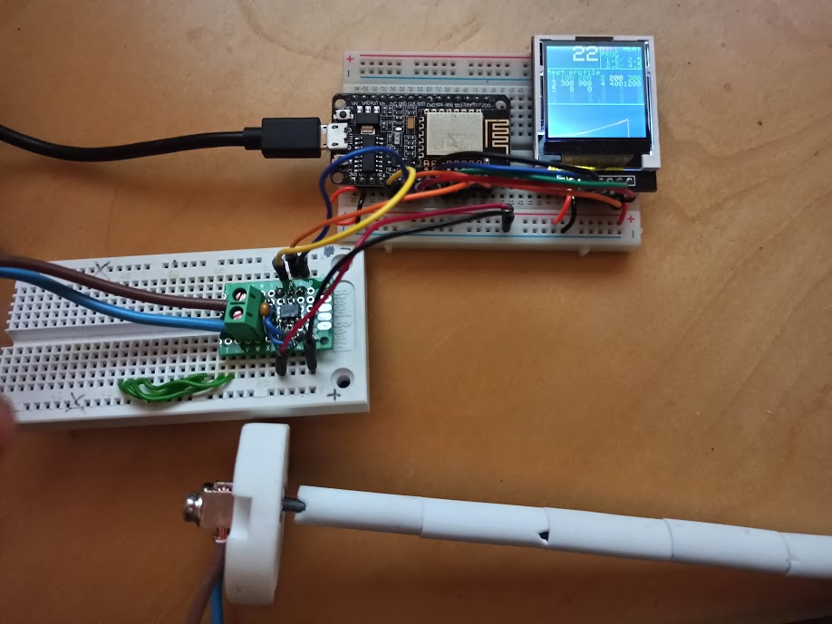

# Golem
A open controller for electric kilns.

## Firing/temperature profiles
A firing profile is described like this:

Segment number | Rate (°C / hr) | Target temperature (°C) | Segment time (hr)
-------------- | -------------- | ----------------------- | -----------------
1 | 100 | 250 | 2.5
2 | 200 | 850 | 3

and the same profile in JSON:

```json
{
  "name" : "Raku",
  "1" : {
    "rate" : 100,
    "target" : 250
    },
  "2" : {
    "rate" : 200,
    "target" : 800
    }
}
```

but currently each profile is stored as a SPIFFS file like ```/prog/<profile name>``` and contains ```<rate>,<target>{,<rate>,<target>}```, for example:

```
80,250,50,800
```

The last open profile and the state of that firing is stored in ```/state/current``` and contains:

```
<profile name>
<segment number>
```

If segment number is zero it means the firing profile is not running.

## Temperature control and graphing
Temperature readings are taken every second. These sliding average over the last 5 seconds is shown as the live temperature. The average over one minute is added to the graph and used for determining if the relays should be on or off during the next minute.
The graph on the TFT shows one Y-pixel per 50 degrees and one X-pixel per 3 minutes.

## Hardware
* ESP8266 or ESP32
* MAX31855
* K-type thermoucouple rated for atleast 1300 degrees
* 1.44 inch TFT (128x128px) (optional)
* 3 x Solid State Relays (one for each phase of the three phase 400VAC kiln)

Hardware test setup:



## User Interface
The user interface is served through a captive portal on the ESP and uses websockets and client side javascript. 
The user can;
* perform CRUD operations on firing profiles
* start and stop a firing profile
* start and stop the kiln manually

## Todo
* Add file browser for uploading, downloading, viewing and editing raw JSON-files. ACE might be a good editor to embed.
